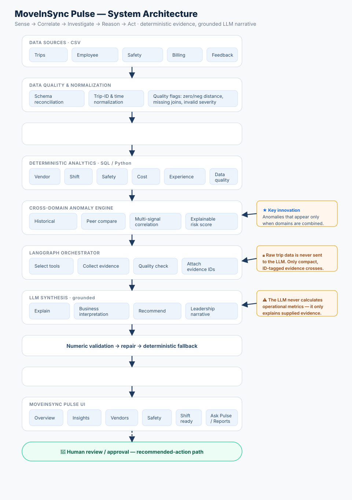

# MoveInSync Pulse

### Autonomous Cross-Signal Mobility Intelligence

MoveInSync Pulse correlates trip, employee, safety, billing and experience signals to detect operational anomalies that may not be visible in a single report. It then investigates the anomaly, explains its business significance, and recommends an appropriate next action.

> **Detect what dashboards miss.**

---

## 1. Problem

Enterprise mobility systems are data-rich but insight-poor. Managers still manually correlate reports across **trips, vendors, billing, safety, shifts/employees and feedback**. Because no single dashboard looks across domains, important anomalies stay hidden — a metric can look normal everywhere in isolation yet be alarming in combination.

## 2. Solution

**Sense → Correlate → Investigate → Reason → Act.**
Deterministic analytics compute the facts, a cross-domain engine detects multi-signal patterns, a LangGraph agent gathers supporting evidence, and an LLM explains it and recommends action — with every number grounded in analytics.

## 3. Key capabilities (all implemented)

- Cross-domain anomaly detection (5 categories)
- Historical benchmarking (vs baseline month)
- Peer comparison (vs eligible-vendor / peer-shift median)
- Vendor intelligence
- Safety anomaly detection
- Billing integrity analysis
- Shift readiness
- Data-quality intelligence (first-class anomalies)
- Agentic investigation (planned tool use + evidence grounding)
- Ask Pulse (natural-language Q&A)
- Leadership executive brief

## 4. Example finding (real — July 2026)

**Aarav Petrov Travel — "Safety divergence" (cross-signal risk 91, HIGH).**
Safety alert frequency rose sharply (139.2 per 1,000 trips, up ~55% vs June and well above the peer median of 68.6) **while** delay and no-show performance actually *improved*.

Why it matters: a traditional single-metric vendor-health score averages these movements together and misses that the problem is **safety-specific**, not general vendor deterioration. This pattern only surfaces when domains are correlated.

*(Numbers read from the live deterministic engine; see [docs/examples/sample-responses.md](docs/examples/sample-responses.md).)*

## 5. Architecture



Full write-up: [docs/architecture/architecture.md](docs/architecture/architecture.md) · Mermaid source: [docs/architecture/architecture.mmd](docs/architecture/architecture.mmd).

## 6. Technology stack

**Frontend:** React · TypeScript · Vite · Tailwind · Recharts
**Backend:** Python · FastAPI · Pydantic
**Analytics:** DuckDB · Parquet · Pandas / SQL
**Agent:** LangGraph · provider-agnostic LLM abstraction
**LLM providers (implemented, pluggable):** Sarvam · OpenAI · Anthropic — selected via `LLM_PROVIDER`; the deterministic product runs with none configured.

## 7. Architecture principle

> **The LLM never calculates operational metrics.**

- Deterministic SQL/Python computes every metric value.
- The cross-signal anomaly engine detects every pattern.
- The agent selects supporting tools and gathers evidence.
- The LLM explains the evidence and recommends qualitative actions — and every number it emits is validated back against the evidence.

Raw trip/employee records never reach the LLM; only compact, ID-tagged aggregate evidence does.

## 8. Getting started

```bash
# backend
python3.12 -m venv .venv && source .venv/bin/activate
python -m pip install -r requirements.txt
python -m uvicorn app.main:app --reload        # http://127.0.0.1:8000  (/docs for Swagger)

# frontend (new terminal)
cd frontend && cp .env.example .env && npm install && npm run dev   # http://127.0.0.1:5173
```

Requires the processed DuckDB at `data/processed/mobility.duckdb`. It is **not** committed (large; not in git). Build it from the hackathon dataset — full instructions, prerequisites and troubleshooting in **[SETUP.md](SETUP.md)**.

## 9. API examples

```bash
curl "http://127.0.0.1:8000/api/overview?month=2026-07"
curl "http://127.0.0.1:8000/api/anomalies/cross-domain?month=2026-07&baseline_month=2026-06"
curl -X POST http://127.0.0.1:8000/api/agent/investigate \
  -H "Content-Type: application/json" \
  -d '{"anomaly_id":"cross-22a4f39765c4","month":"2026-07"}'
```

More: [docs/examples/sample-requests.md](docs/examples/sample-requests.md) · [docs/examples/sample-responses.md](docs/examples/sample-responses.md).

## 10. Demo flow

Overview → Cross-Signal Intelligence → Investigate the Aarav Petrov safety divergence → Ask Pulse → Billing/Data-integrity → Executive brief → Architecture. Full 5-minute script: [docs/demo/demo-script.md](docs/demo/demo-script.md).

## 11. Data-quality handling

Quality is a first-class output, not a silent filter. Preprocessing stamps per-row flags (zero/negative distance, invalid timestamps, missing joins, invalid severity); warnings propagate through analytics → agent → UI. Example: zero-distance bill rows are excluded from cost/km **and** the exclusion is disclosed. Severe, at-scale quality problems are promoted to first-class `data_integrity_anomaly` findings.

## 12. Project structure

```
app/
  analytics/        deterministic analytics + cross_domain_anomalies.py (new engine)
  agents/           LangGraph graph, tools, evidence grounding, validation, fallback
  api/routes/       FastAPI endpoints (incl. /anomalies/cross-domain)
  data/             preprocessing + validators
  db/, llm/, models/
frontend/src/       React UI (Overview, Insights, Drawer, Vendors, Safety, Shifts, Ask, Reports)
scripts/            preprocess.py, build_analytics.py, run_analytics.py
tests/              backend tests (incl. test_cross_domain_anomalies.py)
docs/               architecture, product, examples, demo, screenshots
presentation/       hackathon deck (.pptx) + outline
```

## 13. Limitations / production roadmap

**Implemented:** everything in §3, over an embedded single-file DuckDB warehouse, single tenant, on-demand detection.

**Not implemented (future):** S3 data lake + scheduled/event-driven ingestion; Aurora/PostgreSQL or warehouse; incremental & precomputed aggregates; durable approval/corrective-action workflows; multi-tenancy, RBAC, audit logging; model gateway; observability on latency/token spend. See [docs/product/scalability.md](docs/product/scalability.md) and [docs/architecture/architecture.md](docs/architecture/architecture.md#10-hackathon-architecture-vs-production-evolution).

---

**Docs index:** [Solution overview](docs/product/solution-overview.md) · [Anomaly methodology](docs/product/anomaly-methodology.md) · [Agentic design](docs/product/agentic-design.md) · [Scalability](docs/product/scalability.md) · [Judge Q&A](docs/demo/judge-questions.md) · [Submission summary](SUBMISSION.md)
